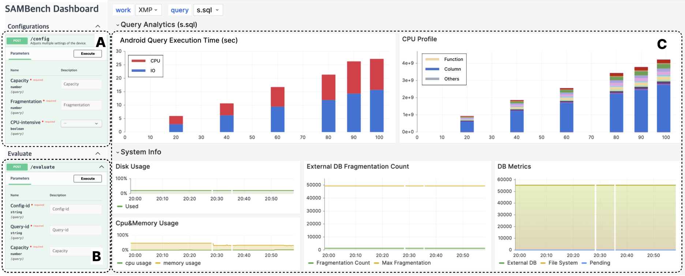

# SAMBench

SQLite Benchmark for Android Media Access

## Introduction

SAMBench offers intuitive web-based dashboards and allows users to evaluate media access performance on different configurations, leveraging media access queries collected from Android applications

SAMBench is a comprehensive benchmarking tool designed to analyze the performance of SQLite database systems with a focus on media access in Android environments. Developed by researchers from Hankuk University of Foreign Studies and Samsung Electronics, this tool addresses the gap in understanding media access's impact on SQLite performance within Android systems. By leveraging media access queries collected from real Android applications, SAMBench offers a nuanced analysis through interactive web-based dashboards, enabling users to evaluate media access performance under various configurations.

## Authors

- Jisub Kim (Hankuk University of Foreign Studies) - <0226daniel@hufs.ac.kr>
- Sehyun Park (Hankuk University of Foreign Studies) - <sarah1918@hufs.ac.kr>
- Hyeeun Jun (Samsung Electronics) - <hyeeun.jun@samsung.com>
- Kisung Lee (Samsung Electronics) - <kiras.lee@samsung.com>
- Woojoong Lee (Samsung Electronics) - <woojoong.lee@samsung.com>
- Jonghyeok Park (Hankuk University of Foreign Studies) - <jonghyeok.park@hufs.ac.kr>

## Features

- **Comprehensive Analysis**: Evaluates SQLite's performance in handling media access within Android, highlighting the implications of media files on database operations.
- **Interactive Dashboards**: Utilizes intuitive web-based dashboards for configuring benchmarks, executing queries, and analyzing results in real-time.
- **Real Application Queries**: Incorporates media access queries from representative Android applications, providing a realistic benchmarking scenario.

## Architecture

SAMBench comprises two main components: a web-based dashboard and a benchmark backend. The dashboard facilitates configuration management, query execution, and interactive analysis. The backend handles API requests, executes commands on Android devices via adb, and collects performance metrics for analysis.



## Getting Started

### Prerequisites for Host Machine

- Ubuntu `20.04.6 LTS`
- [nodejs](https://github.com/nvm-sh/nvm#installing-and-updating) `18.0.0`
- [docker](./docs/docker-install.md) `24.0.7`
- [adb](https://developer.android.com/tools/sdkmanager) `35.0.0-11411520`
- [fastboot](https://developer.android.com/tools/sdkmanager) `35.0.0-11411520`
- sqlite3 `3.45.2`

### Prerequisites for Android Device

- Android device with at least Android version 13
- Android Must be rooted to run the benchmark

### Installation

1. Clone the repository:

   ```sh
   git clone https://github.com/hufs-ids/sambench.git
   ```

2. Navigate to the project directory and install dependencies:

   ```sh
   cd sambench
   yarn install
   ```

3. Start the backend server:

   ```sh
   yarn start
   ```

4. Open the dashboard in your web browser as instructed by the terminal.

### Usage

- **Configuration Management**: Set up your benchmark configurations using the dashboard, specifying parameters such as media file types and system load.
- **Query Execution**: Execute media access queries on your Android device, modifying conditions and configurations as needed.
- **Interactive Analysis**: Analyze the benchmark results through the dashboard, comparing various performance metrics across different configurations.

## Demonstration

SAMBench was demonstrated using a Google Pixel 7, showcasing its ability to construct realistic experimental environments and evaluate SQLite's performance under diverse conditions such as media file types and storage fragmentation.

## License

This work is licensed under the MIT License. See [LICENSE](LICENSE) for more information.

## Acknowledgments

- This project is a collaborative effort between Hankuk University of Foreign Studies and Samsung Electronics.
- Special thanks to all contributors and the open-source community for making this project possible.

## Contact

For any inquiries, please reach out to the authors through their provided email addresses.
